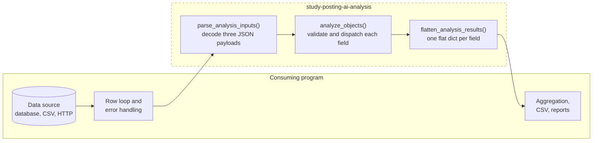
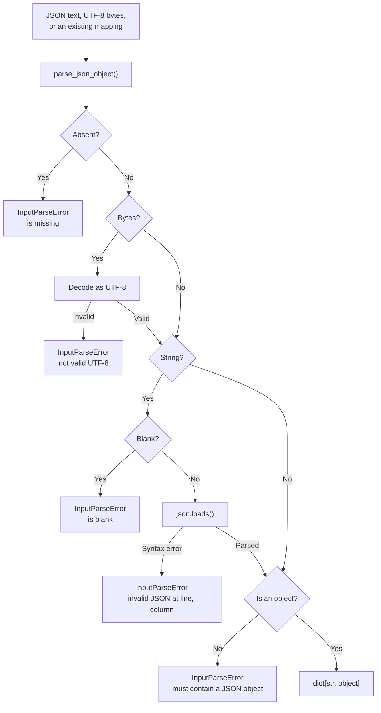
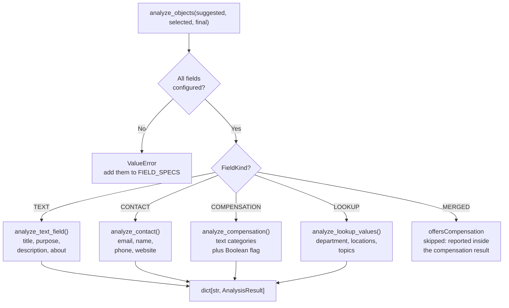
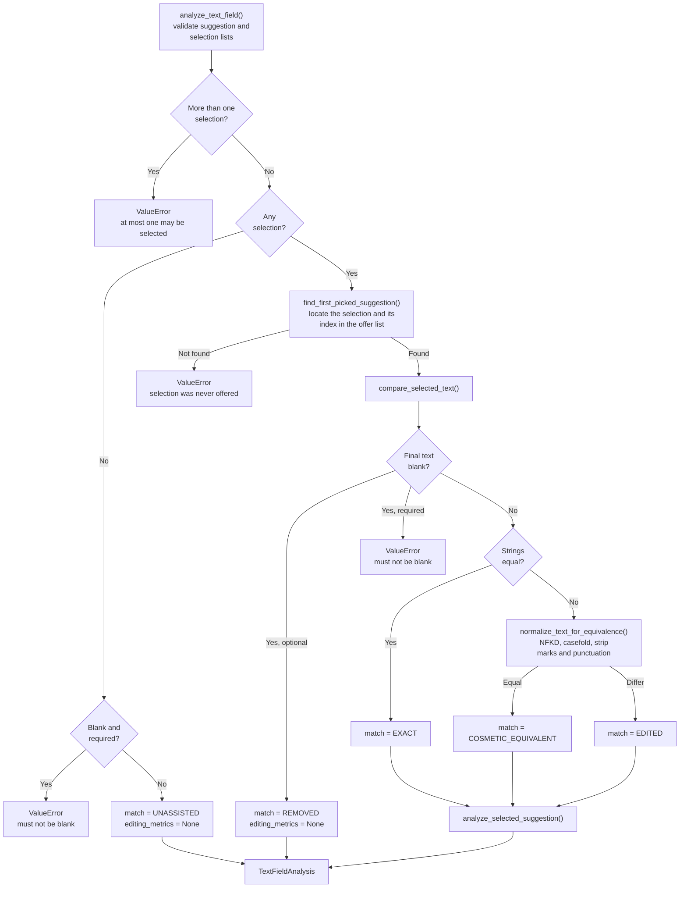
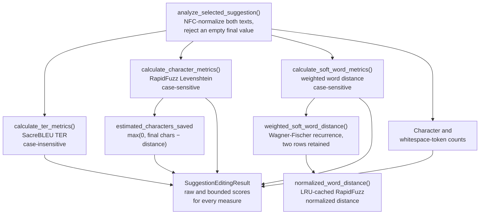
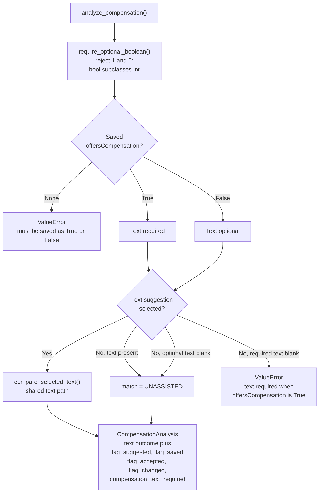
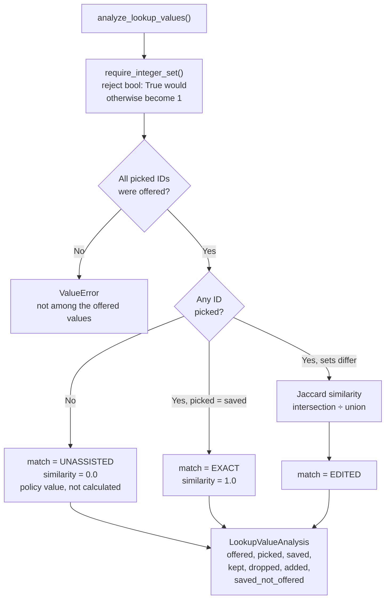
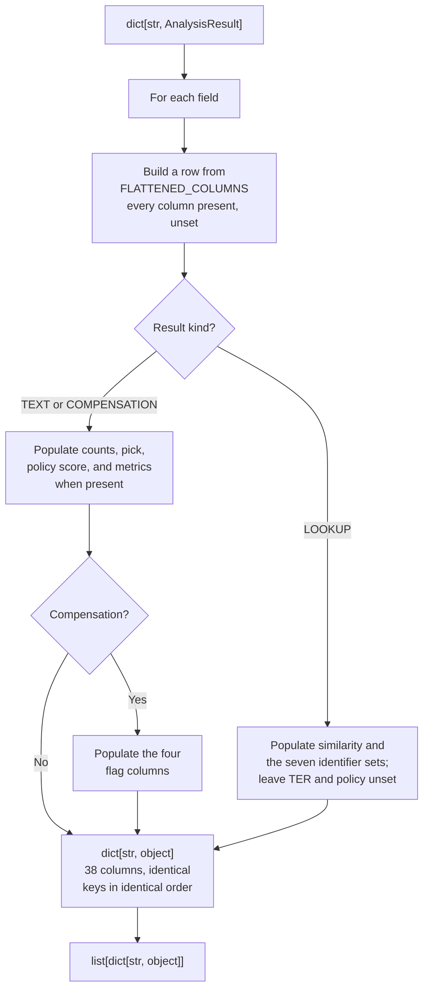

# Program flow

Diagrams render in VS Code with **Markdown Preview Mermaid Support**
(`bierner.markdown-mermaid`), and natively on GitHub.

For metric definitions and business rules, see
[`analysis-specification.md`](analysis-specification.md).

---

## 1. Library boundary

This library performs no input or output. Three decoded objects in, one
structured result per field out. Everything outside the dashed boundary is the
responsibility of a consuming program.



The library raises on invalid input and never logs. A consumer decides whether a
failed record aborts the run or is recorded and skipped.

---

## 2. Input contract



Bytes are decoded explicitly rather than left to `json.loads`, which raises
`UnicodeDecodeError` outside the `JSONDecodeError` hierarchy and infers the
encoding from a byte-order mark. A blank value is reported before parsing,
because an empty column is an expected condition rather than a syntax error at
column 1.

JSON permits six value types; only an object is valid here. The other five are
rejected with the received type named.

---

## 3. Field dispatch

`analyze_objects()` rejects any field absent from `FIELD_SPECS`, then routes each
configured field by its `FieldKind`.



Rejecting unconfigured fields is deliberate: a new form field must not be
silently ignored.

Contact expands into four separately reported subfields, so a record with all
ten configured fields produces twelve results — four contact entries, and none
for the merged `offersCompensation`.

---

## 4. Text field analysis

The shared path for ordinary text fields, contact subfields, and compensation
text.



Evaluation order is **blank, then exact, then cosmetic, then edited**.

Metrics are calculated for all three nonblank outcomes, not only `EDITED`, so an
exact match records a measured score of `1.0` rather than an assumed one.

`REMOVED` and `UNASSISTED` produce no editing metrics, because the normalized
scores would require a zero denominator. Their reported policy score is `0.0`,
which is a meaningful value rather than a missing one.

The cosmetic-equivalence transformation is used **only** for classification. It
never preprocesses a metric input; doing so would hide real edits. A
`COSMETIC_EQUIVALENT` result therefore carries a nonzero character edit distance
alongside its full policy credit.
---

## 5. Metric calculation



| Measure | Formula | Role | Case |
|---|---|---|---|
| TER-derived | `1 − TER` | **Primary** | insensitive |
| Character | `1 − levenshtein / final_chars` | Secondary robustness | sensitive |
| Soft-word | `1 − weighted_distance / final_words` | Robustness | sensitive |
| Characters saved | `max(0, final_chars − distance)` | Absolute proxy | sensitive |

Every raw score may be negative and is retained. Bounded reporting scores are
`clamp01(raw)`. Both are stored, because clamping alone would hide suggestions
that cost more to fix than to rewrite.

The deliberate case asymmetry means a purely capitalization change yields TER
`0.0` while the character and soft-word measures report a nonzero distance —
which is the intended signal that something was edited even though TER regarded
the texts as equivalent.

The soft-word implementation retains only two dynamic-programming rows. A
full-matrix reference implementation in `tests/helpers/` verifies it across 1,500
seeded random cases to twelve decimal places. Unlike TER, it includes no
phrase-shift operation.

---

## 6. Compensation analysis

Two components: the AI-suggested Boolean, and an optional text suggestion. The
**saved** Boolean determines whether text is required.



Boolean acceptance is reported **separately** from text post-editing scores; they
measure different things. When either Boolean is absent, `flag_accepted` and
`flag_changed` are `None` rather than `False`, so records without a recommendation
can be excluded from an acceptance rate.

Two cases worth understanding:

| Scenario | Text outcome |
|---|---|
| AI suggested `False`; user set `True` and wrote text unaided | `UNASSISTED` |
| Suggestion selected, then Boolean set `False` and text cleared | `REMOVED` |

At most one text suggestion may be selected across both categories
(`genericCompensation`, `specificCompensation`).

---

## 7. Lookup field analysis



When nothing was picked, `0.0` is assigned as a realized-assistance policy value
rather than calculated — an empty-set Jaccard formula is undefined.

Lookup similarity measures a different construct from text effort saved and must
never be averaged together with it. The `kept`, `dropped`, `added`, and
`saved_not_offered` sets are derived properties, so they cannot drift out of
agreement with the three stored sets.

---

## 8. Flattening



Every row is built from one template, so all rows share the same keys in the same
order whatever the result kind. A consumer writes a header once and relies on it.

Values are only `None`, `bool`, `int`, `float`, or `str`. Identifier sets are
rendered as sorted JSON arrays, which keeps exported rows stable across runs and
comparable in a diff.

Lookup rows leave `policy_adjusted_effort_saved` and every TER column as `None`.
This is deliberate: `None` means "not applicable," so a mean over text rows
cannot be contaminated by a similarity value.

Free text is excluded unless `include_text=True` is passed, reducing accidental
disclosure of potentially sensitive study content.

---

## 9. Error behavior

The library raises and never logs. A consumer decides what a failure means.

| Condition | Exception |
|---|---|
| Malformed or absent JSON input | `InputParseError`, a `ValueError` |
| Wrong container or value type | `TypeError` |
| Rule violation, such as a blank required field | `ValueError` |
| Unconfigured field present in an input object | `ValueError` |
| Selection that was never offered | `ValueError` |

A blank required field is an error, not a metric of zero. That distinction
matters: a score of zero would silently enter an average, whereas an exception
forces the consumer to decide whether the record is usable.

Every message names the field, and for compensation and contact the prefixed
subfield, so a batch consumer can report precisely which field of which record
failed.

A typical consumer records the failure with its own record identifier and
continues:

```python
for row in rows:
    try:
        results = analyze_objects(*parse_analysis_inputs(*row.payloads))
    except (ValueError, TypeError) as error:
        logger.warning("Record %s failed: %s", row.identifier, error)
        continue

    output.extend(flatten_analysis_results(results, record_id=row.identifier))
```
