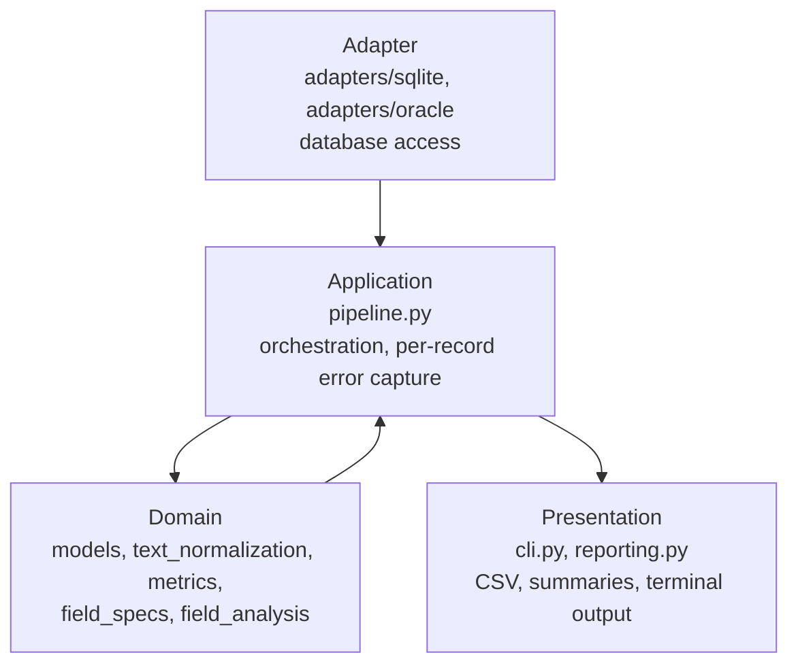
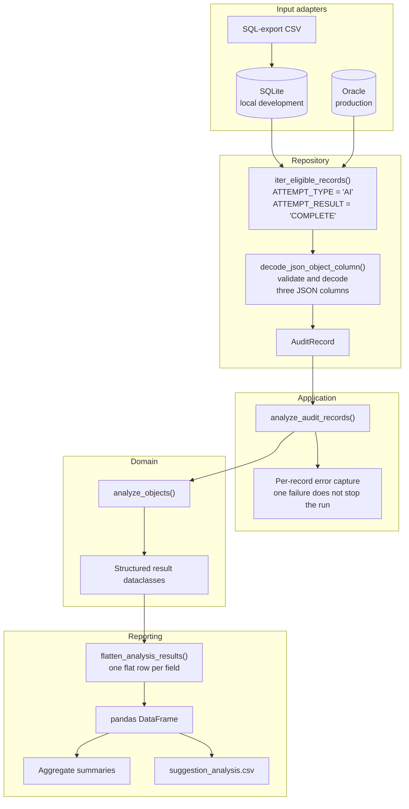
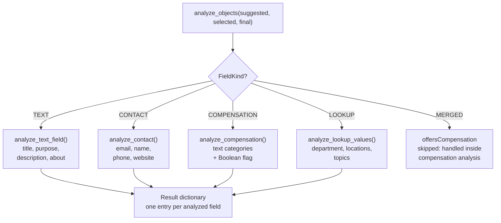
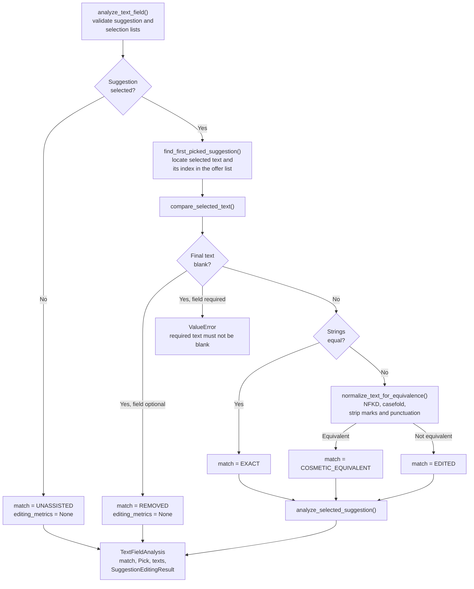
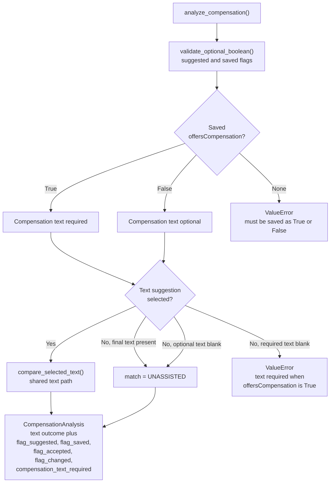
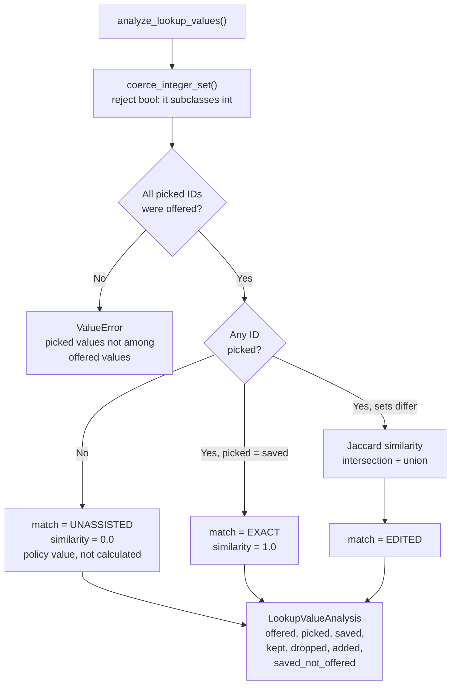
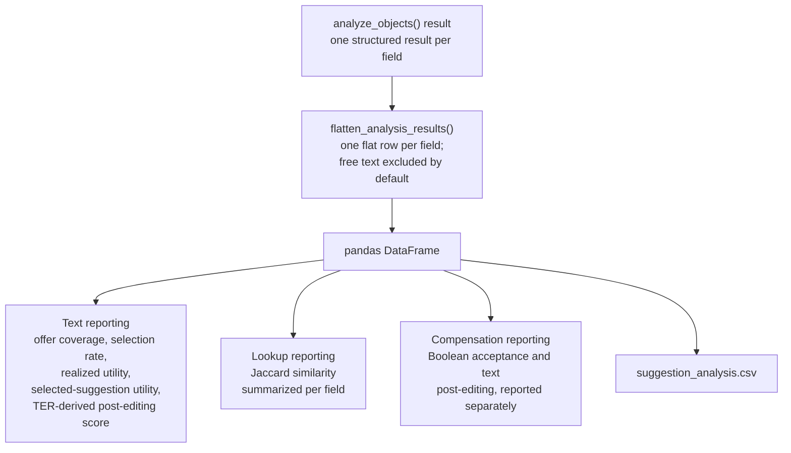
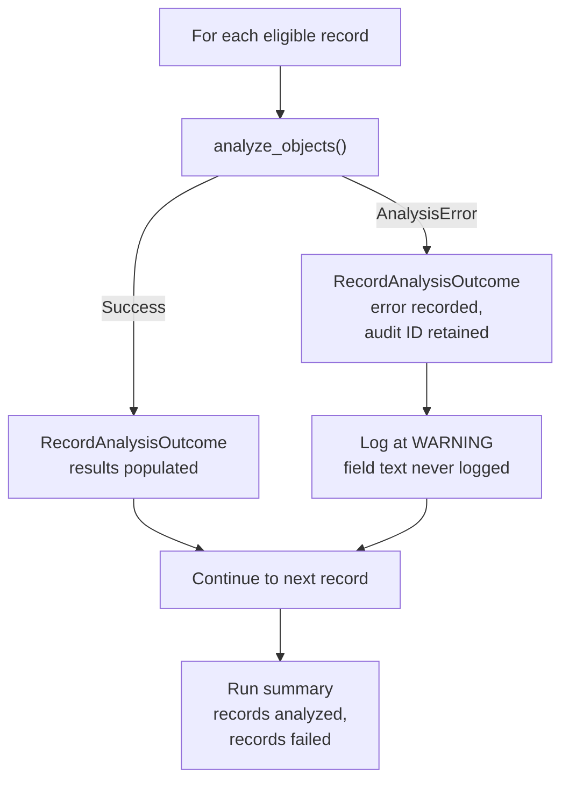

# Program flow and architecture

Diagrams render in VS Code with the **Markdown Preview Mermaid Support**
extension (`bierner.markdown-mermaid`), and natively on GitHub.

For metric definitions and business rules, see
[`analysis-specification.md`](analysis-specification.md).

---

## 1. Layers

Dependencies point inward only. The domain layer does not know that Oracle,
SQLite, pandas, or a notebook exists.

| Layer | Contains | May import |
|---|---|---|
| Presentation | Argument parsing, flattening, DataFrame construction, export | anything |
| Application | Record iteration, error capture, use-case coordination | domain, repository Protocol |
| Domain | Field rules, match classification, metric calculations, result models | stdlib, sacrebleu, rapidfuzz |
| Adapter | Eligibility queries, row mapping, JSON decoding | domain, database drivers |

This separation is what allows the same domain analysis to run from a notebook,
a command-line program, a scheduled job, a web service, or a test suite.

---

## 2. End-to-end pipeline

This mirrors the real-world process: an audit event is stored, eligible events
are selected, JSON payloads are decoded, each field is interpreted according to
its type and business rules, metrics are calculated, and results are transformed
for analysis.

---

## 3. Field dispatch

`analyze_objects()` validates that every top-level key is configured, then routes
each field by its `FieldKind`.

Contact expands into four separately reported subfields
(`contact.email`, `contact.name`, `contact.phone`, `contact.website`).

---

## 4. Text field analysis

The shared path for ordinary text fields, contact subfields, and compensation
text.

Evaluation order is **blank → exact → cosmetic → edited**. Metrics are
calculated for all three nonblank outcomes, not only `EDITED`, so an exact match
records a verifiable score of `1.0` rather than an assumed one.

`REMOVED` and `UNASSISTED` produce no editing metrics, because the
normalized score's final-length denominator would be zero.

---

## 5. Metric calculation

| Measure | Formula | Role |
|---|---|---|
| TER-derived | `1 − TER` | **Primary** |
| Character | `1 − levenshtein / final_chars` | Secondary robustness |
| Soft-word | `1 − weighted_distance / final_words` | Robustness |
| Characters saved | `max(0, final_chars − distance)` | Absolute proxy |

Every raw score may be negative and is retained. Bounded reporting scores are
`clamp01(raw)`. Both are stored; the raw value is never discarded, because
clamping would otherwise hide suggestions that cost more to fix than to rewrite.

---

## 6. Compensation analysis

Two components: the AI-suggested Boolean, and an optional text suggestion. The
**saved** Boolean determines whether text is required.

Boolean acceptance is reported **separately** from text post-editing scores; they
measure different things.

Two cases worth understanding:

| Scenario | Text outcome |
|---|---|
| AI suggested `False`, user changed to `True` and wrote text unaided | `UNASSISTED` |
| Suggestion selected, then Boolean changed to `False` and text cleared | `REMOVED` |

At most one compensation text suggestion may be selected across both categories
(`genericCompensation`, `specificCompensation`).

---

## 7. Lookup field analysis

Lookup similarity is **never** averaged together with text effort-saved scores.
The two measure different constructs and are summarized separately by field.

When nothing was picked, `0.0` is assigned as a realized-assistance policy value
rather than calculated — an empty-set Jaccard formula is undefined.

---

## 8. Reporting

Each statistic has a different denominator and answers a different question:

| Statistic | Denominator | Label |
|---|---|---|
| Fields with an offer ÷ analyzed text fields | all text fields | Suggestion offer coverage |
| Fields with a selection ÷ fields with an offer | offered fields | Suggestion selection rate |
| Mean policy score among offered fields | offered fields | Realized suggestion utility |
| Mean policy score among selected suggestions | selected fields | Selected-suggestion utility |
| Mean `ter_effort_saved` among nonblank post-edits | measurable post-edits | TER-derived post-editing score |

Every reported mean must be accompanied by its denominator or sample count.
Never report an all-text-fields average simply as "effort saved" without stating
its denominator.

---

## 9. Error handling

A single malformed record does not abort a batch. Failures are recorded with the
audit record ID and reported in the run summary, so a partial run is
distinguishable from a complete one.

Validation errors are deliberate and informative — a blank required field is an
error, not a metric of zero.
