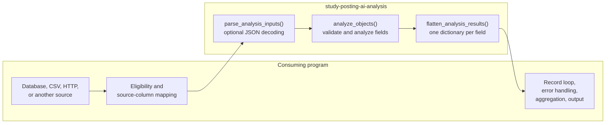
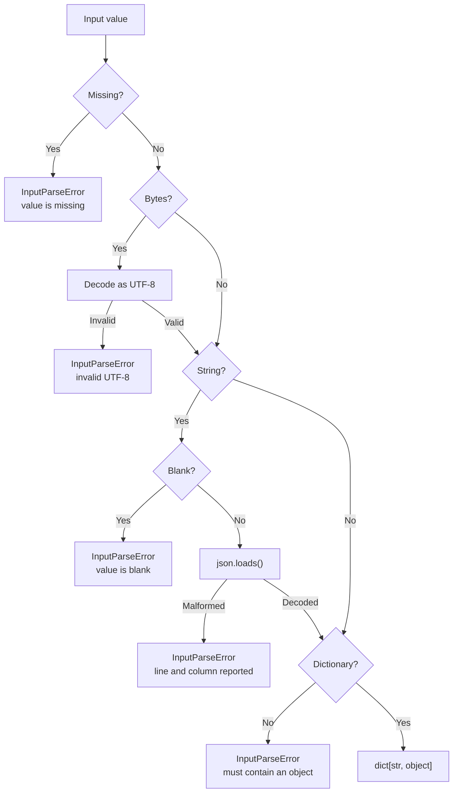
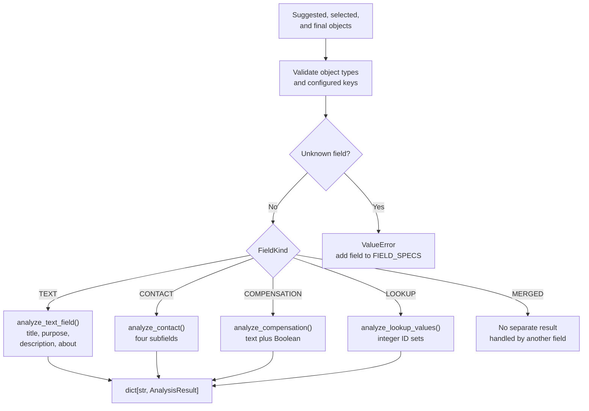
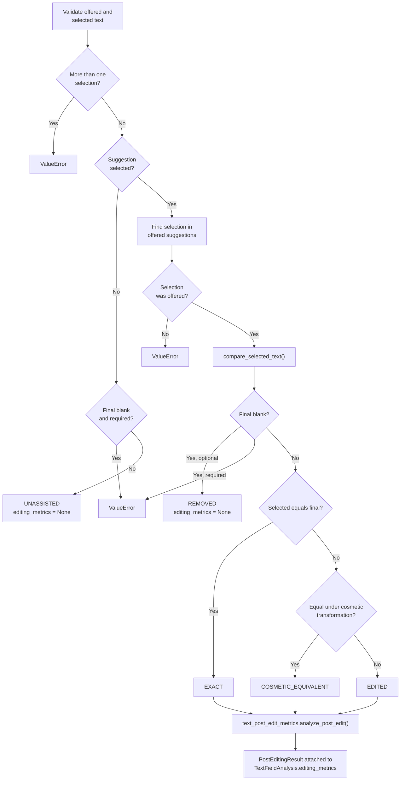
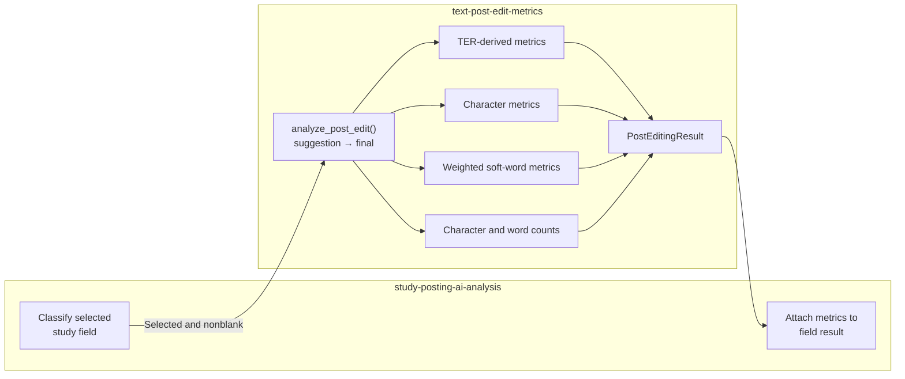
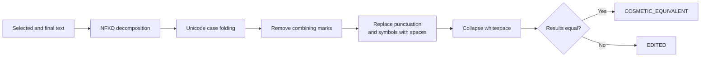
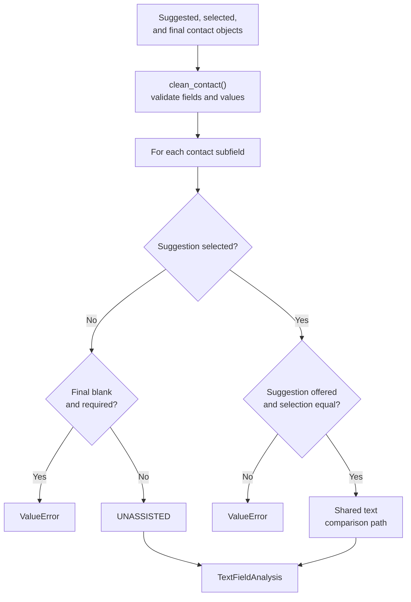
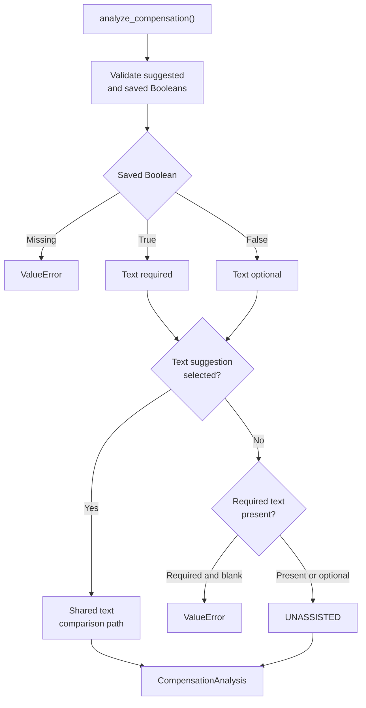
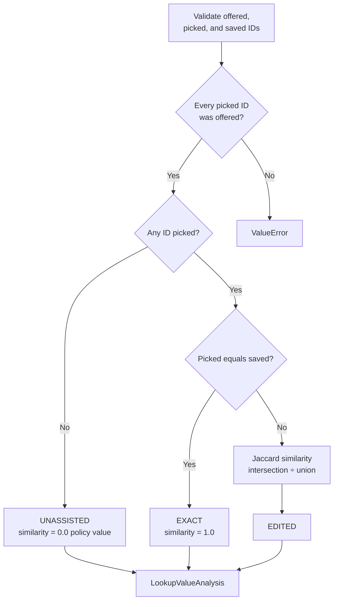
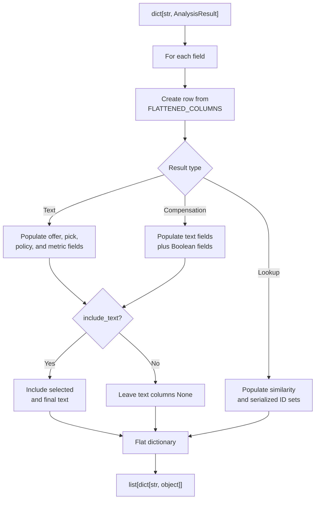

# Study-posting analysis flow

This document describes the control flow of `study-posting-ai-analysis`.

For authoritative business rules, formulas, interpretation, and reporting
terminology, see
[`analysis-specification.md`](analysis-specification.md).

Technical text calculations are implemented by the sibling
[`text-post-edit-metrics`](../../text-post-edit-metrics/) package.

Mermaid diagrams render natively on GitHub and in VS Code with Mermaid-enabled
Markdown preview.

---

## 1. Package boundary

`study-posting-ai-analysis` is a pure library. It receives three objects and
returns structured field results or flattened dictionaries.



The consuming program owns:

- database and file access;
- audit-row eligibility;
- source-column mapping;
- record identifiers;
- batch iteration;
- logging and failure policy;
- aggregation and report writing.

The library raises exceptions and never logs.

---

## 2. Input decoding

`parse_json_object()` accepts:

- a JSON string;
- UTF-8 bytes;
- an already-decoded dictionary.



Valid JSON may decode to a list, number, string, Boolean, or null. Those values
are rejected because the analysis requires a JSON object.

`parse_analysis_inputs()` applies this behavior to the suggested, selected, and
final payloads.

---

## 3. Top-level field dispatch

`analyze_objects()` validates all top-level keys against `FIELD_SPECS`.

An unknown field is rejected so a form change cannot be silently ignored.



`offersCompensation` is configured as `MERGED`. It is reported within the
compensation result rather than as an independent result.

The top-level `contact` object expands into:

- `contact.email`;
- `contact.name`;
- `contact.phone`;
- `contact.website`.

A complete valid input therefore produces twelve field results.

---

## 4. Text outcome classification

Ordinary text, contact text, and selected compensation text share the same final
comparison path.



Classification order is:

```text
blank → exact → cosmetic-equivalent → edited
```

Metrics are calculated for all selected, nonblank outcomes—including `EXACT`
and `COSMETIC_EQUIVALENT`.

`REMOVED` and `UNASSISTED` have no `PostEditingResult`.

---

## 5. Generic text-metric delegation

The study package determines whether comparison is appropriate. The generic
package performs the calculation.



The study package contains no TER, Levenshtein, or weighted soft-word
implementation.

`PostEditingResult` contains no form-field identity. Field identity remains in:

- the result-dictionary key;
- `Pick.kind`;
- flattened `field_name`.

The metric package’s argument direction is significant:

```text
suggestion = selected or applied AI text
final      = final saved text
```

Normalized denominators use final-text length.

---

## 6. Cosmetic-equivalence policy

Cosmetic equivalence is a study-specific classification rule, not metric
preprocessing.



The original selected and final strings—not cosmetically transformed strings—are
passed to `text_post_edit_metrics.analyze_post_edit()`.

This preserves capitalization, punctuation, diacritic, and whitespace edits in
the underlying metrics.

---

## 7. Contact analysis

Each contact subfield offers at most one suggestion.



Required contact fields:

- `email`;
- `name`.

Optional contact fields:

- `phone`;
- `website`.

Unknown contact subfields are rejected.

---

## 8. Compensation analysis

Compensation combines categorized text suggestions with the
`offersCompensation` Boolean.



Compensation-text categories:

- `genericCompensation`;
- `specificCompensation`.

At most one text suggestion may be selected across both categories.

The result reports Boolean acceptance separately from text outcome:

- `flag_suggested`;
- `flag_saved`;
- `flag_accepted`;
- `flag_changed`;
- `compensation_text_required`.

---

## 9. Lookup analysis

Lookup values are sets of integer IDs.



Booleans are rejected because `bool` is a subclass of `int`.

Derived sets are:

- `kept = picked ∩ saved`;
- `dropped = picked − saved`;
- `added = saved − picked`;
- `saved_not_offered = saved − offered`.

Lookup similarity must not be combined with text effort-saved scores.

---

## 10. Flattening

`flatten_analysis_results()` converts structured field results into plain
tabular dictionaries.



Every row:

- contains every name in `FLATTENED_COLUMNS`;
- preserves canonical column order;
- contains only `None`, `bool`, `int`, `float`, or `str`;
- excludes free text unless explicitly requested.

Lookup rows leave text metric and policy fields as `None`.

Identifier sets are serialized as sorted JSON arrays.

---

## 11. Error boundary

The library raises and never logs.

| Condition | Exception |
|---|---|
| Missing, blank, malformed, or non-object JSON | `InputParseError` |
| Wrong runtime type | `TypeError` |
| Requiredness or form-policy violation | `ValueError` |
| Unknown field | `ValueError` |
| Selected value that was not offered | `ValueError` |

A consuming program determines whether an invalid record:

- aborts processing;
- is recorded and skipped;
- is sent to a review queue.

Record identifiers, logging, and batch-failure policy remain outside the
library.
