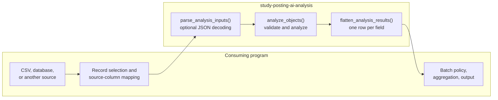
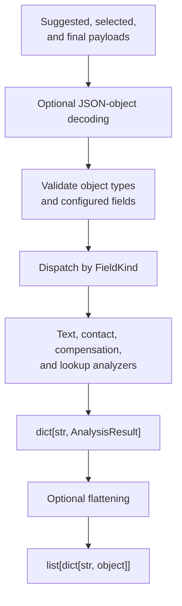
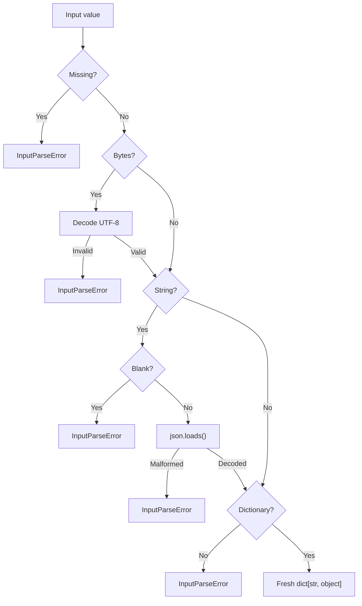
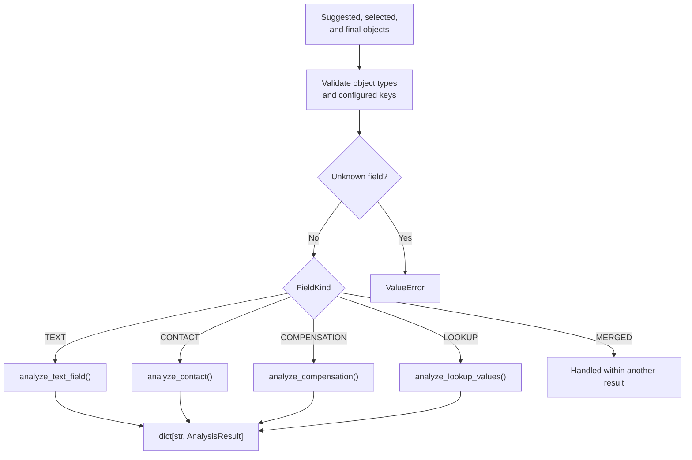
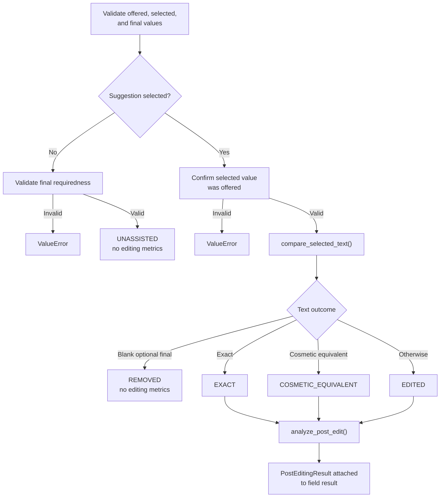
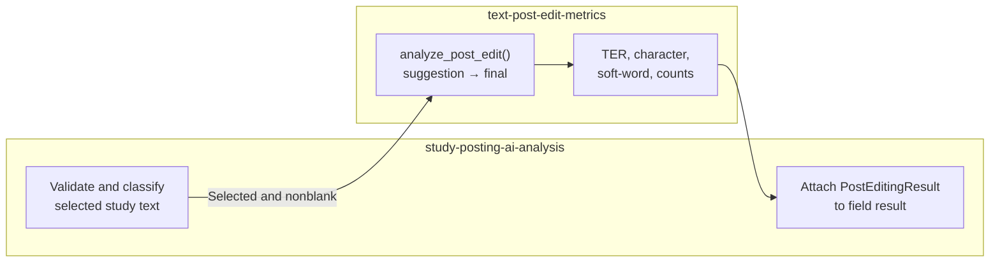
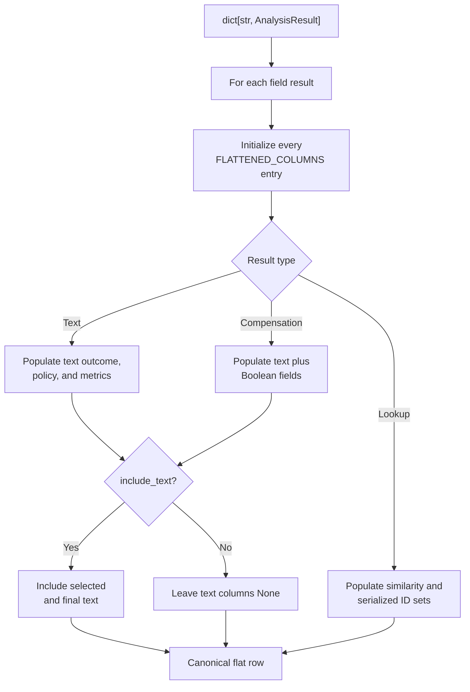

# Study-posting analysis flow

This document describes the control flow and package boundaries of
`study-posting-ai-analysis`.

For authoritative field policy, requiredness, formulas, outcome definitions,
reporting terminology, and interpretation, see
[`analysis-specification.md`](analysis-specification.md).

Generic text calculations are implemented by
[`text-post-edit-metrics`](../../text-post-edit-metrics/).

## 1. Package boundary

The package is a pure, one-record analysis library:

```text
suggested object
selected object
final object
        ↓
study-posting-ai-analysis
        ↓
structured field results
        ↓
optional flattened dictionaries
```

It performs no:

- database or SQL access;
- audit-row selection;
- CSV or filesystem I/O;
- batch iteration;
- aggregation;
- logging;
- command-line handling;
- report publication.

A consuming program owns those responsibilities.



The library raises exceptions and never logs.

## 2. End-to-end analysis

The public composition path is:

```python
from study_posting_ai_analysis import (
    analyze_objects,
    flatten_analysis_results,
    parse_analysis_inputs,
)

suggested, selected, final = parse_analysis_inputs(
    suggested_payload,
    selected_payload,
    final_payload,
)

results = analyze_objects(
    suggested,
    selected,
    final,
)

rows = flatten_analysis_results(
    results,
    record_id="synthetic-record",
    include_text=False,
)
```

A caller that already has validated dictionaries may skip decoding and call
`analyze_objects()` directly.



## 3. Input decoding

`parse_json_object()` accepts:

- a JSON string;
- UTF-8 bytes;
- an already-decoded dictionary.



Valid JSON values that are not objects are rejected.

`parse_analysis_inputs()` applies this behavior independently to the suggested,
selected, and final payloads.

## 4. Top-level field dispatch

`analyze_objects()` validates top-level fields against `FIELD_SPECS`.

Unknown fields are rejected so a source or form change cannot be silently
ignored.



`offersCompensation` is a merged field represented within the compensation
result rather than as an independent result.

The contact object expands into four separately reported results:

```text
contact.email
contact.name
contact.phone
contact.website
```

A complete valid analysis produces twelve field results.

Field definitions and requiredness are authoritative in the
[analysis specification](analysis-specification.md).

## 5. Shared text-analysis path

Ordinary text, contact text, and selected compensation text use the same
comparison path.



The classification order and outcome meanings are defined in the
[analysis specification](analysis-specification.md#5-outcome-vocabulary).

Selected, nonblank outcomes receive generic editing metrics. `REMOVED` and
`UNASSISTED` do not.

## 6. Generic metric delegation

The study package decides whether a generic text comparison is appropriate.
`text-post-edit-metrics` performs the calculation.



The argument direction is:

```text
suggestion = selected or applied AI text
final      = final saved text
```

The study package contains no TER, character-distance, or weighted soft-word
implementation.

`PostEditingResult` contains no study field name. Field identity remains in:

- the result-dictionary key;
- `Pick.kind`;
- flattened `field_name`.

Study cosmetic normalization is used only for outcome classification. The
original selected and final strings are passed to `analyze_post_edit()`.

## 7. Specialized analyzers

### Contact

`analyze_contact()`:

1. validates the suggested, selected, and final contact objects;
2. rejects unknown subfields;
3. validates each selected contact value against the offered value;
4. applies the shared text-analysis path independently to each contact
   subfield;
5. returns four `TextFieldAnalysis` results.

### Compensation

`analyze_compensation()`:

1. validates categorized text suggestions;
2. validates the suggested and saved compensation Booleans;
3. enforces compensation-text requiredness from the saved Boolean;
4. applies the shared text-analysis path when text was selected;
5. returns one `CompensationAnalysis`.

Boolean acceptance and text editing remain separate result dimensions.

### Lookup fields

`analyze_lookup_values()`:

1. validates offered, picked, and saved integer IDs;
2. rejects Boolean values;
3. confirms every picked ID was offered;
4. derives retained, dropped, added, and saved-not-offered sets;
5. classifies the outcome;
6. calculates assisted Jaccard similarity when applicable;
7. returns `LookupValueAnalysis`.

Lookup similarity remains separate from text effort-saved metrics.

Detailed specialized policy is authoritative in the
[analysis specification](analysis-specification.md).

## 8. Flattening

`flatten_analysis_results()` converts structured field results into canonical
tabular dictionaries.



Every flattened row:

- contains every name in `FLATTENED_COLUMNS`;
- preserves canonical column order;
- contains only `None`, `bool`, `int`, `float`, or `str`;
- excludes selected and final text unless `include_text=True`.

Lookup sets are serialized as sorted JSON arrays. Lookup rows leave
text-specific metric and policy columns as `None`.

The consuming program owns file output and data-handling controls.

## 9. Errors

The library raises and never logs.

| Condition | Exception |
|---|---|
| Missing, blank, malformed, or non-object JSON | `InputParseError` |
| Wrong runtime type | `TypeError` |
| Requiredness or study-policy violation | `ValueError` |
| Unknown field | `ValueError` |
| Selected value that was not offered | `ValueError` |

A consuming program decides whether an invalid record:

- aborts processing;
- is recorded and skipped;
- is sent for review.

Record IDs, logging, batch policy, and report publication remain outside this
package.
